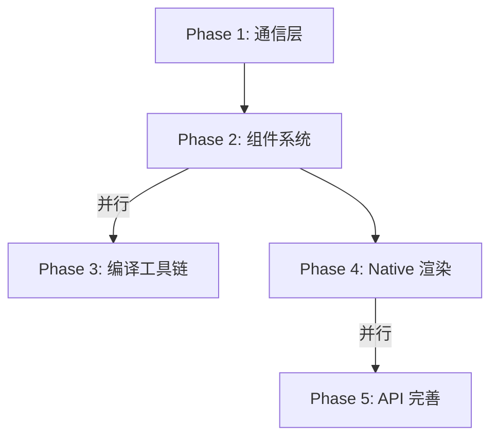

# MiniFramework

本项目是一个面向 Android 平台的 JSBridge 框架，借鉴微信小程序的架构理念，采用“逻辑层（V8 引擎）+ 渲染层（Native/WebView）”双线程解耦设计。业务 JS 代码运行在独立的 V8 线程，UI 渲染由原生或 WebView 驱动，通过高效的消息桥接实现前后端分离。框架支持组件化、虚拟 DOM、生命周期管理等特性，适用于动态化页面、跨端复用、热更新等多种移动应用场景。

## 项目结构

- **app/**：主应用模块，集成 MiniFramework 并加载 demo 页面
- **framework/**：核心框架模块，包含 JS 引擎、消息总线、渲染器等

## 核心特性

- **双线程架构**：业务 JS 运行在 V8 引擎线程，UI 渲染在主线程 WebView
- **JSBridge 通信**：高效 JS ↔ Native 消息分发，支持回调、事件、异步
- **小程序化页面模型**：支持生命周期、数据驱动、虚拟 DOM、Patch 渲染
- **高可扩展性**：消息总线、渲染协议、API 桥接均可扩展

## 路线图：WebView JSBridge → 小程序化框架演进

从现有 URL Scheme 拦截式 JSBridge 出发，分 5 个阶段逐步演进为类微信小程序框架。核心思路：双线程架构（逻辑层 V8 + 渲染层 Native/WebView 混合），通过抽象通信层实现渲染引擎可替换。Android 优先，预留跨端扩展点。

**架构总览：**

```text
开发者代码 (WXML + WXSS + JS)
   ↓ 编译
模板 IR + 样式对象 + JS Bundle
   ↓
┌─────────────────┐    消息总线    ┌──────────────────┐
│  逻辑线程(V8).   │ ←──────────→  │   渲染线程(UI)     │
│  App/Page/Comp  │               │ Native组件/WebView│
│  数据绑定引擎     │               │  布局引擎(Yoga)    │
│  API 代理层      │               │  事件收集器        │ 
└────────┬────────┘               └────────┬─────────┘
    │                                  │
    └──────── Native Bridge ───────────┘
         │
         ┌─────────┴─────────┐
         │  平台能力层(API)   │
         │ 网络/存储/设备/UI  │
         └───────────────────┘
```

### Phase 1: 通信层抽象与双线程雏形 (基础设施)
目标: 将 URL Scheme 拦截替换为结构化消息通道，引入 V8 独立线程
1. 定义统一消息协议 — BridgeMessage { type, module, method, callbackId, data }，支持 request/response/event 三种类型，JSON 序列化
2. 集成 Javet (V8 绑定) — 在独立 HandlerThread 上运行 V8 Runtime，封装 JSEngine 接口：evaluate(), callFunction(), registerGlobal()
3. 实现 MessageBus — Native 侧维护 callbackId → CompletableFuture 映射，JS 侧注入 __bridge__.postMessage()，线程间通过 Handler/Looper 传递
4. WebView 退化为渲染终端 — 业务 JS 全部迁移到 V8 线程，WebView 只通过 evaluateJavascript() 接收渲染指令
验证: V8 线程 setData({title:"hello"}) → WebView 正确渲染；WebView 点击 → V8 收到回调

### Phase 2: 组件系统与虚拟 DOM (渲染内核)
目标: 实现小程序组件模型，引入 VNode diff 驱动渲染更新
1. 设计 VNode 结构 — { tag, props, children, eventBindings, key }，支持 view/text/image/scroll-view 等标签
2. 实现 setData → diff → patch 流水线 — 模板求值 → 新 VTree → diff 产出 patches → 序列化发送到渲染层
3. Component 基类 — 生命周期 created→attached→ready→detached，支持 properties/data/methods/observers
4. Page 基类 — 继承 Component，增加 onLoad→onShow→onReady→onHide→onUnload 和页面栈管理
5. App 基类 — onLaunch→onShow→onHide，全局 globalData，getApp()
验证: diff 算法单测；setData 触发 DOM 更新 < 16ms；生命周期顺序正确

### Phase 3: DSL 编译器与工具链 (可与 Phase 2 并行)
目标: 支持 WXML + WXSS + JS 开发方式
1. WXML 模板编译器 (Node.js) — 输入模板 → 输出 render 函数，支持 wx:if/for、{{}} 插值、bind:/catch: 事件
2. WXSS 样式处理器 — rpx→px 换算(750rpx基准)、组件级样式作用域隔离
3. 打包器 — 编译产出 app-service.js(逻辑) + app-view.js(模板render) + app.css + app.json
4. CLI — mini dev(开发+热更新)、mini build(生产)、mini preview(推送设备)
验证: 带列表渲染的页面编译后跑通；rpx 不同屏宽正确；热更新 < 2s

### Phase 4: Native 渲染引擎 (核心突破, 最大工作量)
目标: 核心组件用 Native View 渲染，实现性能飞跃
1. Renderer 抽象接口 — createNode/updateNode/removeNode/setLayout，WebViewRenderer(fallback) + NativeRenderer(新方案)
2. 集成 Yoga 布局引擎 — WXSS Flexbox 属性 → Yoga 节点 → 绝对坐标 → Native View 布局
3. 核心 Native 组件映射:
   * view → FrameLayout, text → TextView, image → ImageView(+Coil)
   * scroll-view → RecyclerView(虚拟滚动), input → EditText, button → MaterialButton, swiper → ViewPager2
4. 事件系统 Native 化 — Native 事件标准化为 { type, target, detail, timeStamp }，支持冒泡(bind)/截断(catch)
5. 混合渲染策略 — page.json 配置 "renderer": "native"|"webview"，不支持的组件 fallback 到 WebView
验证: 同页面双 Renderer 视觉一致；Native 列表滚动 FPS ≥ 55；混合切换无闪屏

### Phase 5: 平台 API 与完善 (可与 Phase 4 并行)
目标: 补全 API 体系，达到可用于实际业务的程度
1. API 模块化框架 — JS 侧 mini.xxx() → MessageBus → Native APIModule.invoke()
2. 核心 API 实现 — 网络(request/upload/socket)、存储(MMKV)、设备(systemInfo/network/scan)、UI(toast/modal)、路由(navigateTo/back/switchTab)
3. 路由与页面栈 — TabBar、页面栈上限(10层)、转场动画、页面间参数传递
4. 安全沙箱 — V8 中禁用 eval/Function，无 document/window/XMLHttpRequest，API 权限控制
5. 性能优化 — V8 Snapshot 加速启动、setData 批量合并、预渲染骨架、长列表虚拟化
验证: 能运行含网络请求+列表+详情+Tab的完整小程序；冷启动首帧 < 1s；Monkey 30 分钟无内存泄漏

### 关键技术选型

| 项目       | 选型           | 理由                         |
|------------|----------------|------------------------------|
| JS 引擎    | V8 via Javet   | 性能最优，活跃维护           |
| 布局引擎   | Yoga           | Facebook 成熟方案，Flexbox 完善 |
| 模板编译   | Node.js 自研   | 灵活可控                     |
| 存储       | MMKV           | 微信出品，高性能 KV          |
| 序列化     | JSON → FlatBuffers(可选) | 先简单后优化 |

### 阶段依赖关系



> 阶段说明：Phase 1 是所有后续阶段的基础，Phase 2 之后可并行推进 Phase 3，Phase 4 是最大工作量，Phase 5 可与 Phase 4 并行。

### 决策记录
* 渲染策略: 混合方案，页面级选择 Native 或 WebView，渐进迁移
* 平台: Android 优先，Renderer/JSEngine 接口预留跨端扩展点
* DSL: 类微信小程序 WXML+WXSS+JS，降低开发者迁移成本
* 不含: IDE/开发者工具界面、云服务、小程序分发平台（仅框架 SDK + CLI）

## 运行流程

1. MainActivity 初始化 MiniFramework，创建 V8 引擎、WebView 渲染器
2. 通过 framework.loadScriptFromAsset("pages/demo.js") 加载 JS 页面
3. 业务 JS 通过桥接与 Native 通信，渲染结果推送到 WebView
4. WebView 只负责渲染，不执行业务 JS，事件回传给 V8 线程处理

## 新增：页面跳转与多页面示例

本次更新支持 JS 侧页面跳转能力，演示了多页面切换的完整流程：

- **页面跳转机制**：业务 JS 通过 mini.callAPI('navigation', 'navigateTo', { page: 'pages/second.js' }) 请求 Native 加载新页面脚本，实现页面间跳转。
- **示例页面**：
  - `pages/demo.js`：主页面，包含“跳转到第二页”按钮，点击后通过 JSBridge 跳转到 second.js。
  - `pages/second.js`：第二页，包含“返回首页”按钮，点击后通过 JSBridge 跳转回 demo.js。
- **注意事项**：所有页面 JS 需用 MiniFramework.Page 声明式注册，页面内容用 h(...) 虚拟 DOM 构建，不能直接操作 document/DOM。

**示例代码片段：**

_demo.js_
```js
MiniFramework.Page({
  // ...
  onJumpPage: function() {
    if (typeof mini !== 'undefined' && mini.callAPI) {
      mini.callAPI('navigation', 'navigateTo', { page: 'pages/second.js' });
    }
  }
});
```

_second.js_
```js
MiniFramework.Page({
  render: function() {
    return h('div', {},
      h('h2', null, 'Second Page'),
      h('div', { bindtap: 'onBack' }, '返回首页')
    );
  },
  onBack: function() {
    if (typeof mini !== 'undefined' && mini.callAPI) {
      mini.callAPI('navigation', 'navigateTo', { page: 'pages/demo.js' });
    }
  }
});
```

- **V8 线程专用**：页面 JS 运行在 V8 线程，不能直接用 document/DOM API。
- **JSBridge 通信**：推荐统一用 mini.callAPI 进行 Native 通信。

更多细节见 pages/demo.js、pages/second.js 及 MiniFramework 源码。

### 关键文件说明

- `framework/src/main/assets/framework.js`：JS 侧运行时，负责桥接通信、vNode、diff/patch 等
- `framework/src/main/java/com/mini/framework/MiniFramework.java`：框架入口，初始化各核心组件
- `framework/src/main/java/com/mini/framework/bridge/MessageBus.java`：消息总线
- `framework/src/main/java/com/mini/framework/engine/V8Engine.java`：V8 引擎封装
- `framework/src/main/java/com/mini/framework/render/WebViewRenderer.java`：WebView 渲染器
- `app/src/main/assets/pages/demo.js`：示例小程序页面

## 构建与运行

1. 安装 JDK 17+，并配置好 Android SDK（cmdline-tools 推荐 8.0+ 或 latest）
2. 终端执行：
   ```sh
   ./gradlew clean build -Dorg.gradle.java.home=你的JDK17路径
   ```
3. 或直接用 Android Studio 打开项目并运行

## 常见问题

- **cmdline-tools 版本兼容**：如遇 SDK XML v4 警告，请升级 cmdline-tools 至 8.0 或 latest
- **依赖无法下载**：请检查网络或切换到官方 mavenCentral 源

## 参考/致敬
- 微信小程序架构思想
- Javet (V8 for Java)

---
如需二次开发或源码解读，详见各模块源码注释。
